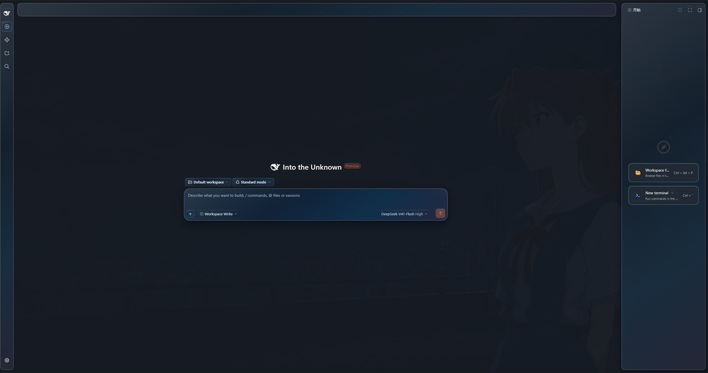

# 主题-明日香 // 02

[English](README.md)

面向 DeepSeek Harness Web UI 的非官方明日香主题插件。插件提供明、暗两套外观、早/午/晚三张右侧人物壁纸，以及与本机时间同步的平滑背景切换。

> 本项目是非官方同人作品，与 DeepSeek、khara、Evangelion 及相关权利方不存在关联。

## 预览



## 兼容性

- DSH：`0.1.7-rc.2`
- Cordis：`4.0.4`
- 开发环境：Node.js `>=20`
- 目标平台：Ubuntu / WSL2 Ubuntu，使用 DSH Web 和 Linux Chrome

v3.1.0 面向 DSH `0.1.7-rc.2`，已通过自动测试、隔离 Host API smoke 和完整的 Windows DSH Web 安装/浏览器验证。Ubuntu/WSL2 的实机验证来自上一 DSH 基线，尚未针对 0.1.7-rc.2 复测；具体证据与边界见 [COMPATIBILITY.md](docs/COMPATIBILITY.md)。

## 安装

### 从 GitHub Release 安装（推荐）

```bash
dsh plugin --profile web add https://github.com/Yyyyyylor/dsh-asuka-school-theme/releases/download/v3.1.0/dsh-asuka-school-theme-3.1.0.tgz
```

本项目暂未发布到 npm。GitHub Release 中的 `.tgz` 是已构建、带版本号的发布包，推荐直接使用。

### 从 GitHub 源码安装

```bash
dsh plugin --profile web add github:Yyyyyylor/dsh-asuka-school-theme#v3.1.0
```

该方式要求主机已安装 Git。请固定到标签而非 `main`，避免后续更新带来不可预期的变动。

### 从本地项目安装

在项目根目录执行：

```bash
pnpm install
pnpm build
npm pack
dsh plugin --profile web add ./dsh-asuka-school-theme-3.1.0.tgz
```

最后一条命令中的文件名应与 `npm pack` 实际输出的 `.tgz` 文件一致。

安装、更新或移除后，请重启 DSH Web profile。

## 使用方式

1. 在 **设置 → 通用 → Theme-Asuka** 中快速切换“关闭 / 上学路上 / 午间教室 / 东京-3 夜”。
2. 在 **设置 → Theme-Asuka** 中调整壁纸时段、透明度、模糊、装饰细节、减少动态效果，并可重置插件设置。
3. 默认“壁纸时段”为自动模式，按本机时间切换：
   - 早：06:00–11:00
   - 午：11:00–17:00
   - 晚：17:00–次日 06:00

新会话页与会话底部输入框使用同一套更轻透的场景化液态玻璃表面，让壁纸保留更多可见细节。会话标题旁的编辑操作可直接修改当前会话名称，无需离开会话页面。

自动切换使用交叉淡入效果；启用“减少动态效果”后会关闭该动画。插件不会改写 DSH 官方的浅色、深色或系统外观，只叠加所选的壁纸场景。

壁纸会在解码完成后再开始原有的交叉淡入，并在浏览器空闲时预载可能的下一场景。透明度和模糊度调节会按动画帧合并预览更新，且不会重复应用无关的主题变量，从而让连续拖动更加流畅。

## 隐私与资源

插件不收集凭据、遥测或浏览器 `localStorage` 数据。标量偏好存储在 DSH 插件 entry `asuka-school-theme` 的 live Config 表单中；DSH 会把旧设置文档迁移到 profile，入口 ID 和偏好字段不变。

公开壁纸位于 `assets/public/`；相关使用说明见 [assets/LICENSE.md](assets/LICENSE.md) 与 [docs/ASSETS.md](docs/ASSETS.md)。请勿将私有开发素材放入发布包。

Host 只读取包内三张壁纸，通过现有 DSH Web server 提供固定 GET/HEAD 路由。浏览器通过 DSH 同源传输访问图片、设置和用户主动编辑的会话标题；不连接第三方服务、不上传数据、不收集遥测、不读取凭据、不启动子进程。运行依赖锁定为 Schemastery `3.18.4`，DSH/Cordis 由宿主提供为 optional peers，不另装运行组件；没有安装期生命周期脚本。依赖、权限与失败边界见[商店审查说明](STORE-REVIEW.md)。独立供应链审查和商店自动复检仍待完成，声明完整不保证自动获批。

## 开发与验证

维护者请先阅读[项目索引](docs/README.md)与[项目专属 AGENTS.md](AGENTS.md)。

```bash
pnpm build
pnpm test
pnpm check
npm pack --dry-run
```

发布包预构建了 `lib/index.js` 与 `lib/client.js`，最终用户安装插件时不需要执行 postinstall 构建。

更多说明见 [docs/COMPATIBILITY.md](docs/COMPATIBILITY.md) 与 [docs/RESEARCH.md](docs/RESEARCH.md)。
